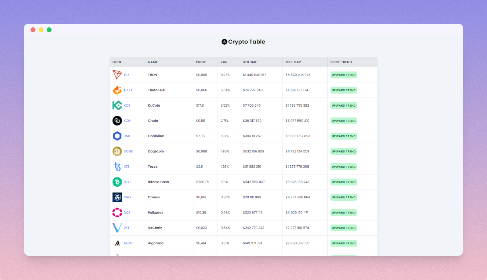
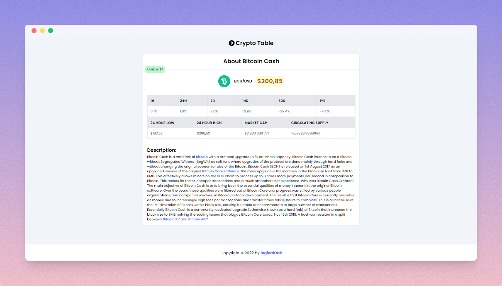

### 🥝 Crypto Table

An application for monitoring current information on the state of the cryptocurrency market.

**[Demo](https://crypto-table-app.vercel.app/)**

---

#### 🧶 Screenshots:

**Main Page:**

**Detail Page:**

---

#### 🧶 Use links

-   [CoinGecko API](https://api.coingecko.com/api/v3/coins/)

---

#### 🧶 Tech Stack

**Client:**

-   [React](https://ru.reactjs.org/)
-   [Redux](https://redux.js.org/)
-   [Redux Toolkit](https://redux-toolkit.js.org/)
-   [TailwindCSS](https://tailwindcss.com/)
-   [Sass](https://sass-lang.com/)
-   [Axios](https://axios-http.com/docs/intro)

#### 🧶 Authors

-   [@logicalOak](https://github.com/logicalOak)
